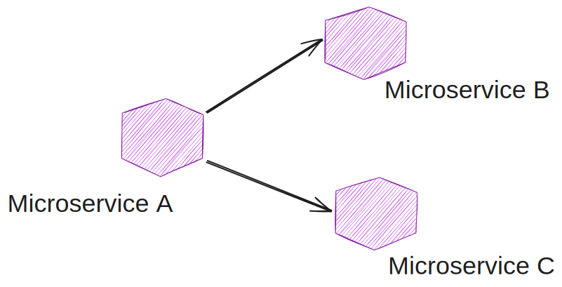

# otus-msa
  

Pre-Deployment Тесты
--------------------
Пишутся внутри проекта и запускаются перед деплоем

1 Юнит-тесты
JUnit

2 Интеграционные Тесты
Тестконтейнер

3 Компонентные тесты
WireMock

4 Контрактные тесты (ориентированные на потребителя)
Spring Cloud Contract, PACT

Post-Deployment тесты
---------------------
5 System Integration Tests (SIT) или E2E Tests
rest-assured

6 Тесты производительности
Gatling

7 Тесты и сканирование безопасности и уязвимости
OWASP ZAP

8 Хаотическое тестирование

9 Мутационное тестирование

10 Исследовательское тестирование

### References 

`1.` The Practical Test Pyramid https://martinfowler.com/articles/practical-test-pyramid.html  

`2.` Postman: POST, localhost:8082/transform, Headers: Content-Type application/json, Body raw JSON "Hello World"  

`3.` REST Assured https://testit.software/blog/post/rest-assured-i-postman-dva-podhoda-k-testirovaniyu-api  

